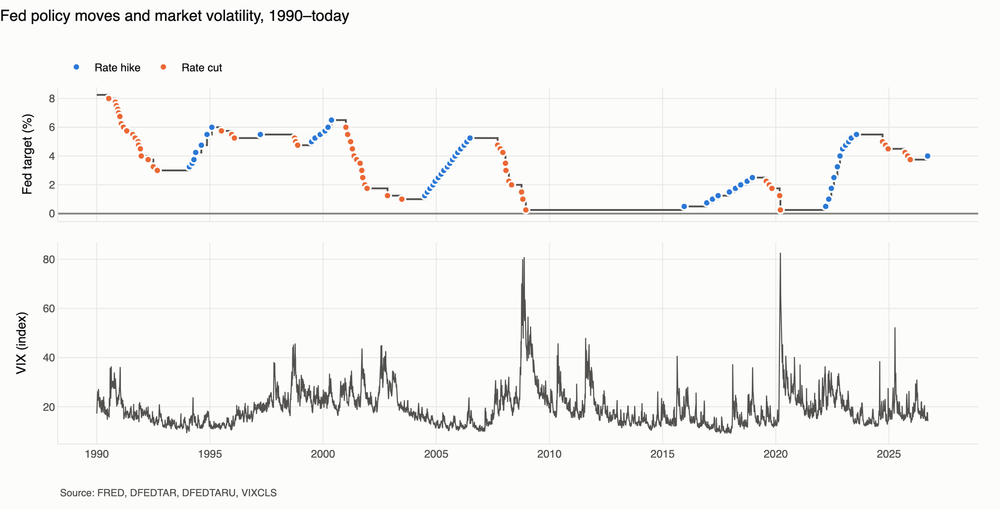
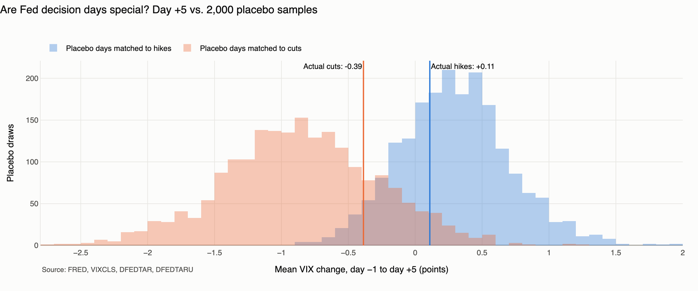
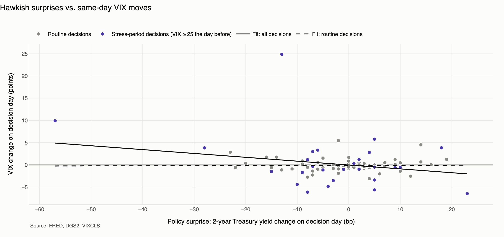
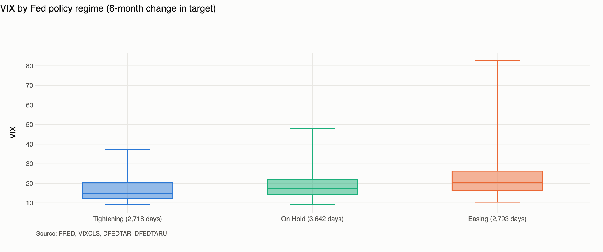
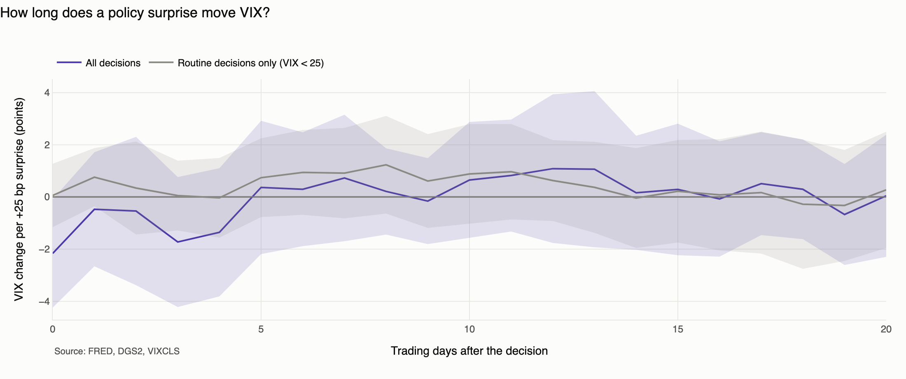

# Fed Policy & Market Volatility

**Do Federal Reserve rate decisions move market volatility, and by how much?**

This is an exploratory analysis for **FinTechCo** (a fictional financial services company) on 36 years of public
[FRED](https://fred.stlouisfed.org/) data. It is built as a working example of how
[Claude Code](https://docs.claude.com/en/docs/claude-code/overview) lets quants and data scientists go from a
business question to a tested, reproducible analysis without writing boilerplate.

> *"Your team needs to quickly understand how Federal Reserve policy changes might affect portfolio strategy.
> How do they historically affect market volatility, and can we quantify the relationship?"*



---

## Key findings

*Data pulled from FRED on 2026-09-25 · 92 FOMC rate changes since Feb 1994 · volatility measured by VIX (30-day implied S&P 500 volatility).*

| # | Finding | Evidence |
|---|---|---|
| 1 | **The Fed cuts into stress and hikes into calm.** Causality runs strongly from volatility to policy. | VIX averages **27.2** the day before a cut vs. **17.1** before a hike. 53% of cuts happen with VIX ≥ 25. |
| 2 | **Rate decisions alone don't measurably move VIX.** The post-cut decline is ordinary mean reversion. | Compared with random days at the same VIX level, no horizon (1, 5, or 20 days) is significant for hikes or cuts (all p ≥ 0.14). |
| 3 | **Volatility is higher in easing regimes, but that's association, not effect.** | Mean VIX **22.8** when easing vs. **16.6** when tightening. Realized NASDAQ volatility shows the same pattern (24.6% vs. 18.4%). |
| 4 | **Only surprises matter, only in stress, and only briefly.** | A +25 bp hawkish surprise goes with **−4.0 VIX points** in stress periods (p < 0.01) and **≈ 0** for routine decisions (p = 0.92). The effect is gone by the next day. |

**So what for portfolio strategy:** routine, well-communicated FOMC decisions are not volatility events.
Policy-related volatility risk is concentrated in **stress periods with surprise easing**, where an unexpectedly
dovish Fed signals that it sees more trouble than the market does (the "Fed information effect").

<table>
<tr>
<td></td>
<td></td>
</tr>
<tr>
<td></td>
<td></td>
</tr>
</table>

---

## Methodology

| Step | Approach | Why it matters |
|---|---|---|
| **Policy events** | Every change in the Fed funds target. `DFEDTAR` (to Dec 2008) is spliced with the upper bound of `DFEDTARU`. The sample starts Feb 1994, when the FOMC began announcing decisions. | Gives one consistent event list across the switch to a target range. |
| **Event study** | Change in VIX from day −1 to day +20 around each decision, with 95% confidence bands. | Shows the typical path of volatility around a decision. |
| **Matched placebo test** | 2,000 samples of random non-decision days, **matched to the same VIX decile**, with an empirical p-value. | VIX mean-reverts and the Fed cuts when VIX is high. Without matching, the Fed would get credit for ordinary mean reversion. |
| **Policy regimes** | Each day labeled tightening, easing, or on hold from the 6-month change in the target. Compares implied (VIX) and realized volatility. | Tests whether the volatility environment differs across policy cycles. |
| **Surprise regressions** | ΔVIX regressed on the decision-day 2-year Treasury yield change (the surprise proxy), with HC1 robust errors. Local projections cover horizons 0–20 days. Split into routine vs. stress (VIX ≥ 25) decisions. | Separates the *unexpected* part of a decision from moves already priced in, and measures how long the effect lasts. |

**Caveats.** The Fed reacts to markets, so regime results are descriptive. The daily 2-year yield also absorbs
other same-day news. Stress-period samples are small (n = 27). FRED has no scheduled vs. emergency meeting
flag. Nothing here has been tested out of sample as a trading signal. The notebook covers each of these in detail.

### Data sources

| FRED series | Description | Role |
|---|---|---|
| [`VIXCLS`](https://fred.stlouisfed.org/series/VIXCLS) | CBOE Volatility Index | Outcome: implied volatility |
| [`NASDAQCOM`](https://fred.stlouisfed.org/series/NASDAQCOM) | NASDAQ Composite | Realized-volatility robustness check |
| [`DFEDTAR`](https://fred.stlouisfed.org/series/DFEDTAR) | Fed funds target rate (to 2008-12-15) | Policy decisions |
| [`DFEDTARU`](https://fred.stlouisfed.org/series/DFEDTARU) | Fed funds target range, upper bound | Policy decisions |
| [`DGS2`](https://fred.stlouisfed.org/series/DGS2) | 2-year Treasury constant-maturity yield | Policy-surprise proxy |

---

## Quickstart

Requires [uv](https://docs.astral.sh/uv/) and a free [FRED API key](https://fred.stlouisfed.org/docs/api/api_key.html).

```bash
git clone https://github.com/mikemalv/Anthropic.git && cd Anthropic
uv sync                                  # Python 3.11+ environment and dependencies
cp .env.example .env                     # then add your FRED_API_KEY
uv run jupyter lab notebooks/fed_policy_volatility.ipynb
```

The first run downloads the five series into `data/raw/` (one dated CSV per series). Later runs use the cache and
work offline. To pull fresh data, call `fetch_series(..., refresh=True)`.

```bash
uv run pytest                            # offline tests on synthetic data, no key needed
uv run ruff check . && uv run ruff format .
```

> **Viewing on GitHub:** charts in the notebook are interactive Plotly figures, which GitHub doesn't render.
> Open the notebook locally (JupyterLab or VS Code) to hover over events and inspect individual decisions.

---

## Project structure

```
├── CLAUDE.md                        # Project instructions for Claude Code (conventions, guardrails)
├── notebooks/
│   └── fed_policy_volatility.ipynb  # The analysis: narrative, tables, interactive charts
├── src/fintechco_demo/
│   ├── fred_client.py               # FRED fetch + on-disk cache (the only module that uses the network)
│   ├── cleaning.py                  # Target splice, event list, trading-calendar alignment
│   ├── analysis.py                  # Event paths, matched placebo, regimes, local projections
│   └── charts.py                    # Plotly figure builders (DataFrame in, Figure out)
├── tests/test_pipeline.py           # Unit tests on synthetic data
├── docs/images/                     # Static chart exports used in this README
└── data/raw/                        # Cached FRED pulls (gitignored)
```

The notebook contains the story. The reusable logic lives in small, typed, tested modules, so the team can build on
it (for example, a Streamlit dashboard in `app/`) without copying notebook cells.

---

## Security & compliance

Built the way it would need to be at a regulated financial institution. These rules are written into
[`CLAUDE.md`](CLAUDE.md), so Claude Code follows them in every session.

- **Secrets:** the API key is read from `.env` (gitignored) and never hardcoded, printed, or logged. Error messages
  from the FRED client leave out the request URL because it contains the key.
- **Data:** public FRED data only. No customer data or PII.
- **Network:** a single allowed external host (`api.stlouisfed.org`).
- **Reproducibility:** every raw pull is cached with its series ID and pull date, so every number traces back to
  a dated source file. Data-cleaning decisions (forward-fill limits, sample start) are logged and stated in the
  notebook.

---

## Extending with Claude Code

`CLAUDE.md` gives Claude Code the project's conventions, commands, and guardrails, so extensions are a prompt away:

```text
Add the MOVE index and high-yield spreads (BAMLH0A0HYM2) to the regime table and tell me
whether the tightening/easing gap holds for rates and credit volatility.

Split the surprise regression into hawkish vs. dovish surprises and test whether the
response is asymmetric.

Turn the context and surprise sections into a Streamlit page in app/dashboard.py with a
date-range filter.
```

Possible next steps for the team: include "hold" decisions through an FOMC meeting calendar, use futures-based
surprise measures (Kuttner, Bauer–Swanson), and translate the regime results into hedging-cost or VaR-limit terms
for client presentations.

---

<sub>Built with Claude Code as part of a FinTechCo demo. Data: Federal Reserve Bank of St. Louis (FRED).
This analysis is illustrative and is not investment advice.</sub>
